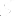

# An abstract model for Common Schema Definition Language

07/01/2024

## Introduction

CSDL stands for Common Schema Definition Language, a language for
defining data models that can be used across different platforms and
technologies. CSDL is used by the OData protocol, a standard for
building and consuming RESTful APIs that expose data as resources.

There are two concrete notations for CSDL: CSDL XML and CSDL JSON. They
are semantically equivalent, but they use a different syntax: XML and
JSON, respectively. Both notations are defined by specifications that
use a mixture of formal grammar and natural language to describe
the structure and meaning of individual parts of the language.

The current specifications do not provide a way to verify an implementation
against the standard or allow to compare the two notations formally.
They also do not facilitate the browsability and searchability of the documents
as they rely on prose to explain the concepts and rules.

This document introduces a more formal specification of an abstract CSDL
model, which is independent of any concrete notation but can be represented by the two
given stadards. The abstract CSDL model defines the core concepts and rules of CSDL in
a machine-readable format, using a more formal notation. The abstract CSDL model can be
used to derive the concrete notations, as well as to validate and test implementations.

### Benefits of the Abstract CSDL Model

- Machine-readable: The abstract CSDL model can be processed by
  automated tools, such as parsers, validators, generators, and
  translators. This can improve the quality and consistency of CSDL
  documents and implementations.

- Verification of implementations: The abstract CSDL model can be used
  as a reference for testing and verifying the compliance of CSDL
  implementations with the standard. This can increase the
  interoperability and compatibility of different platforms and
  technologies that use CSDL.

- Improve browsability and searchability: The abstract CSDL model can
  be used as a basis for creating hyperlinked and searchable documents
  that explain the concepts and rules of CSDL in a more structured and
  accessible way. This can enhance the usability and learnability of
  CSDL for developers and users.

### Structure of the Document

This document is organized as follows:

- Section 2 defines the basic concepts and notation of the abstract
  CSDL model.

- Section 3 specifies the abstract syntax and semantics of the
  abstract CSDL model.

- Section 4 shows how the concrete CSDL notations can be derived from
  the abstract CSDL model.

- Section 5 discusses some open issues and future work.

- Section 6 concludes the document and provides some references.

## Abstract CSDL

The Common Schema Definition Language (CSDL) is a language for defining
data models that can be exposed as RESTful services. CSDL can be
represented in two different formats: XML and JSON. Both formats have
the same expressive power and can describe the same set of data models,
but they have different syntax and conventions. In this document, we
define an abstract CSDL model that captures the essential features of
both formats and serves as a common ground for understanding and
manipulating CSDL documents.

The abstract CSDL model consists of a set of **model elements**, each with

- a name,
- a set of properties,
- and a set of relationships to other model elements.

The model elements represent the concepts and constructs of
the data model, such as entity types, complex types, enum types,
properties, navigation properties, functions, actions, annotations, etc.
The properties define the attributes and characteristics of the model
elements, such as their type, multiplicity, nullability, default value,
etc. The relationships define the connections and dependencies between
the model elements, such as inheritance, containment, association, etc.

The abstract CSDL model is a labeled property graph, where the nodes are
the model elements, the labels are the model element names, and the
edges are their relationships. Each node can also have a set of
key-value pairs as properties. A labeled property graph is a general and
flexible data structure that can represent any kind of data model or
schema. In this document, we provide a schema for the abstract CSDL
graph, which specifies the rules and constraints for creating valid CSDL
models. The meta-model defines the following aspects of the abstract
CSDL model:

- The list of allowed model elements and their properties.

- The list of allowed parent-child relationships and their
  cardinalities.

- The list of allowed additional relationships and their
  cardinalities.

- The semantics and validation rules for each model element, property,
  and relationship.

The abstract CSDL model is independent of any concrete notation or
format. However, it can be serialized and deserialized using different
formats, such as XML or JSON. In this document, we also describe the
mapping rules between the abstract CSDL model and its concrete
representations. The mapping rules define the following aspects of the
concrete CSDL formats:

- The syntax and structure of the format.

- The naming and encoding conventions for model elements, properties,
  and especially the relationships.

- The transformation rules for converting between the abstract CSDL
  model and the concrete CSDL format.

By defining an abstract CSDL model and its mapping rules to concrete
formats, we aim to achieve the following goals:

- To provide a clear and precise definition of the CSDL language and
  its semantics.

- To enable interoperability and compatibility between different CSDL
  formats and tools.

- To facilitate the development and evolution of the CSDL language and
  its implementations.

- To simplify the learning and usage of the CSDL language for data
  modelers and service developers.

## Abstract CSDL model

This document describes the abstract CSDL model elements of OData 4.01.

### Table of contents

- [Action model element](#action-element)
- [ActionImport model element](#actionimport-element)
- [Annotation model element](#annotation-element)
- [Annotations model element](#annotations-element)
- [ComplexType model element](#complextype-element)
- [EntityContainer model element](#entitycontainer-element)
- [EntitySet model element](#entityset-element)
- [EntityType model element](#entitytype-element)
- [EnumType model element](#enumtype-element)
- [Function model element](#function-element)
- [FunctionImport model element](#functionimport-element)
- [Key model element](#key-element)
- [Member model element](#member-element)
- [NavigationProperty model element](#navigationproperty-element)
- [NavigationPropertyBinding model element](#navigationpropertybinding-element)
- [OnDelete model element](#ondelete-element)
- [Parameter model element](#parameter-element)
- [PrimitiveType model element](#primitivetype-element)
- [Property model element](#property-element)
- [PropertyRef model element](#propertyref-element)
- [ReferentialConstraint model element](#referentialconstraint-element)
- [ReturnType model element](#returntype-element)
- [Schema model element](#schema-element)
- [Singleton model element](#singleton-element)
- [Term model element](#term-element)
- [TypeDefinition model element](#typedefinition-element)

## Schema Element

The `Schema` element defines a schema.

### Schema child elements

- [Action](#action-element)
- [Annotations](#annotations-element)
- [Annotation](#annotation-element)
- [ComplexType](#complextype-element)
- [EntityContainer](#entitycontainer-element)
- [EntityType](#entitytype-element)
- [EnumType](#enumtype-element)
- [Function](#function-element)
- [Term](#term-element)
- [TypeDefinition](#typedefinition-element)
- [PrimitiveType](#primitivetype-element)

### Schema element attributes

| **&nbsp;**        | **Name**  | **Constraint** | **Type**                         | **Default** |
| ----------------- | --------- | -------------- | -------------------------------- | ----------- |
|  | Namespace | Required       | [String](#string-attribute-type) |             |
|  | Alias     | Optional       | [String](#string-attribute-type) |             |

## Annotations Element

The `Annotations` element is used to apply a group of annotations to a single model element

### Annotations child elements

- [Annotation](#annotation-element)

### Annotations element attributes

| **&nbsp;**        | **Name**  | **Constraint** | **Type**                                                                   | **Default** |
| ----------------- | --------- | -------------- | -------------------------------------------------------------------------- | ----------- |
|  | Target    | Required       | [AnnotatableElementReference](#annotatableelementreference-attribute-type) |             |
|  | Qualifier | Optional       | [String](#string-attribute-type)                                           |             |

## EntityType Element

The `EntityType` element defines a new entity type.

### EntityType child elements

- [Property](#property-element)
- [NavigationProperty](#navigationproperty-element)
- [Key](#key-element)
- [Annotation](#annotation-element)

### EntityType element attributes

| **&nbsp;**        | **Name**  | **Constraint** | **Type**                                                   | **Default** |
| ----------------- | --------- | -------------- | ---------------------------------------------------------- | ----------- |
|  | Name      | Required       | [String](#string-attribute-type)                           |             |
|  | BaseType  | Optional       | [EntityTypeReference](#entitytypereference-attribute-type) |             |
|  | Abstract  | Optional       | [Boolean](#boolean-attribute-type)                         | false       |
|  | OpenType  | Optional       | [Boolean](#boolean-attribute-type)                         | false       |
|  | HasStream | Optional       | [Boolean](#boolean-attribute-type)                         | false       |

## Key Element

An entity type's key refers to the set of properties whose values uniquely identify an instance of the entity type within an entity set.

### Key child elements

- [PropertyRef](#propertyref-element)

## PropertyRef Element

The `PropertyRef` element specifies a key property.

### PropertyRef element attributes

| **&nbsp;**        | **Name** | **Constraint** | **Type**                                           | **Default** |
| ----------------- | -------- | -------------- | -------------------------------------------------- | ----------- |
|  | Alias    | Optional       | [String](#string-attribute-type)                   |             |
|  | Name     | Required       | [KeyPropertyPath](#keypropertypath-attribute-type) |             |

## Property Element

A structural property is a property of a structured type that has one a type with value semantics. (primitive, complex, enumeration or collections thereof

### Property child elements

- [Annotation](#annotation-element)

### Property element attributes

| **&nbsp;**        | **Name**     | **Constraint** | **Type**                                                 | **Default** |
| ----------------- | ------------ | -------------- | -------------------------------------------------------- | ----------- |
|  | Name         | Required       | [String](#string-attribute-type)                         |             |
|  | Type         | Required       | [ValueTypeReference](#valuetypereference-attribute-type) |             |
|  | Nullable     | Optional       | [Boolean](#boolean-attribute-type)                       |             |
|  | DefaultValue | Optional       | [String](#string-attribute-type)                         |             |
|  | MaxLength    | Optional       | [NonNegativeInteger](#nonnegativeinteger-attribute-type) |             |
|  | Precision    | Optional       | [NonNegativeInteger](#nonnegativeinteger-attribute-type) |             |
|  | Scale        | Optional       | [NonNegativeInteger](#nonnegativeinteger-attribute-type) |             |
|  | Unicode      | Optional       | [Boolean](#boolean-attribute-type)                       |             |
|  | SRID         | Optional       | [String](#string-attribute-type)                         |             |

## NavigationProperty Element

A navigation property allows navigation to related entities.

### NavigationProperty child elements

- [ReferentialConstraint](#referentialconstraint-element)
- [OnDelete](#ondelete-element)
- [Annotation](#annotation-element)

### NavigationProperty element attributes

| **&nbsp;**        | **Name**       | **Constraint** | **Type**                                                   | **Default** |
| ----------------- | -------------- | -------------- | ---------------------------------------------------------- | ----------- |
|  | Name           | Required       | [String](#string-attribute-type)                           |             |
|  | Type           | Required       | [EntityTypeReference](#entitytypereference-attribute-type) |             |
|  | Nullable       | Optional       | [Boolean](#boolean-attribute-type)                         |             |
|  | Partner        | Optional       | [PropertyPath](#propertypath-attribute-type)               |             |
|  | ContainsTarget | Optional       | [Boolean](#boolean-attribute-type)                         | false       |

## ReferentialConstraint Element

The `ReferentialConstraint` element specifies a constraint that binds the properties of the dependent end of an association to the properties of the principal end of the association.

### ReferentialConstraint child elements

- [Annotation](#annotation-element)

### ReferentialConstraint element attributes

| **&nbsp;**        | **Name**           | **Constraint** | **Type**                                     | **Default** |
| ----------------- | ------------------ | -------------- | -------------------------------------------- | ----------- |
|  | Property           | Required       | [PropertyPath](#propertypath-attribute-type) |             |
|  | ReferencedProperty | Required       | [PropertyPath](#propertypath-attribute-type) |             |

## OnDelete Element

A navigation property MAY define an on-delete action that describes the action the service will take on related entities when the entity on which the navigation property is defined is deleted.

### OnDelete child elements

- [Annotation](#annotation-element)

### OnDelete element attributes

| **&nbsp;**        | **Name** | **Constraint** | **Type**                         | **Default** |
| ----------------- | -------- | -------------- | -------------------------------- | ----------- |
|  | Action   | Required       | [Action](#action-attribute-type) |             |

## ComplexType Element

Complex types are keyless nominal structured types.

### ComplexType child elements

- [Property](#property-element)
- [NavigationProperty](#navigationproperty-element)
- [Annotation](#annotation-element)

### ComplexType element attributes

| **&nbsp;**        | **Name** | **Constraint** | **Type**                                                     | **Default** |
| ----------------- | -------- | -------------- | ------------------------------------------------------------ | ----------- |
|  | Name     | Required       | [String](#string-attribute-type)                             |             |
|  | BaseType | Optional       | [ComplexTypeReference](#complextypereference-attribute-type) |             |
|  | Abstract | Optional       | [Boolean](#boolean-attribute-type)                           | false       |
|  | OpenType | Optional       | [Boolean](#boolean-attribute-type)                           | false       |

## EnumType Element

Enumeration types are nominal types that represent a non-empty series of related values. Enumeration types expose these related values as members of the enumeration.

### EnumType child elements

- [Member](#member-element)
- [Annotation](#annotation-element)

### EnumType element attributes

| **&nbsp;**        | **Name**       | **Constraint** | **Type**                                                     | **Default** |
| ----------------- | -------------- | -------------- | ------------------------------------------------------------ | ----------- |
|  | Name           | Required       | [String](#string-attribute-type)                             |             |
|  | IsFlags        | Optional       | [Boolean](#boolean-attribute-type)                           | false       |
|  | UnderlyingType | Required       | [NumericTypeReference](#numerictypereference-attribute-type) |             |

## Member Element

Enumeration type values consist of discrete members. Each member is identified by its name, a simpleidentifier

### Member child elements

- [Annotation](#annotation-element)

### Member element attributes

| **&nbsp;**        | **Name** | **Constraint** | **Type**                           | **Default** |
| ----------------- | -------- | -------------- | ---------------------------------- | ----------- |
|  | Name     | Required       | [String](#string-attribute-type)   |             |
|  | Value    | Optional       | [Integer](#integer-attribute-type) |             |
|  | IsFlags  | Optional       | [Boolean](#boolean-attribute-type) | false       |

## TypeDefinition Element

A type definition defines a specialization of one of the primitive types or of the built-in abstract type `Edm.PrimitiveType`.

### TypeDefinition child elements

- [Annotation](#annotation-element)

### TypeDefinition element attributes

| **&nbsp;**        | **Name**       | **Constraint** | **Type**                                                         | **Default** |
| ----------------- | -------------- | -------------- | ---------------------------------------------------------------- | ----------- |
|  | Name           | Required       | [String](#string-attribute-type)                                 |             |
|  | UnderlyingType | Required       | [PrimitiveTypeReference](#primitivetypereference-attribute-type) |             |
|  | MaxLength      | Optional       | [NonNegativeInteger](#nonnegativeinteger-attribute-type)         |             |
|  | Unicode        | Optional       | [Boolean](#boolean-attribute-type)                               |             |
|  | Precision      | Optional       | [NonNegativeInteger](#nonnegativeinteger-attribute-type)         |             |
|  | Scale          | Optional       | [Scale](#scale-attribute-type)                                   |             |
|  | SRID           | Optional       | [NonNegativeInteger](#nonnegativeinteger-attribute-type)         |             |

## Action Element

Actions are service-defined operations that MAY have observable side effects and MAY return a single instance or a collection of instances of any type.

### Action child elements

- [ReturnType](#returntype-element)
- [Parameter](#parameter-element)
- [Annotation](#annotation-element)

### Action element attributes

| **&nbsp;**        | **Name**      | **Constraint** | **Type**                                       | **Default** |
| ----------------- | ------------- | -------------- | ---------------------------------------------- | ----------- |
|  | Name          | Required       | [String](#string-attribute-type)               |             |
|  | IsBound       | Optional       | [Boolean](#boolean-attribute-type)             |             |
|  | EntitySetPath | Optional       | [EntitySetPath](#entitysetpath-attribute-type) |             |

## Function Element

Functions are service-defined operations that MUST NOT have observable side effects and MUST return a single instance or a collection of instances of any type

### Function child elements

- [ReturnType](#returntype-element)
- [Parameter](#parameter-element)
- [Annotation](#annotation-element)

### Function element attributes

| **&nbsp;**        | **Name**      | **Constraint** | **Type**                                       | **Default** |
| ----------------- | ------------- | -------------- | ---------------------------------------------- | ----------- |
|  | Name          | Required       | [String](#string-attribute-type)               |             |
|  | IsBound       | Optional       | [Boolean](#boolean-attribute-type)             |             |
|  | IsComposable  | Optional       | [Boolean](#boolean-attribute-type)             |             |
|  | EntitySetPath | Optional       | [EntitySetPath](#entitysetpath-attribute-type) |             |

## ReturnType Element

The `ReturnType` element specifies the type of the return value of an action or function.

### ReturnType child elements

- [Annotation](#annotation-element)

### ReturnType element attributes

| **&nbsp;**        | **Name**     | **Constraint** | **Type**                                                 | **Default** |
| ----------------- | ------------ | -------------- | -------------------------------------------------------- | ----------- |
|  | Type         | Required       | [TypeReference](#typereference-attribute-type)           |             |
|  | IsComposable | Optional       | [Boolean](#boolean-attribute-type)                       |             |
|  | Nullable     | Optional       | [Boolean](#boolean-attribute-type)                       | true        |
|  | DefaultValue | Optional       | [String](#string-attribute-type)                         |             |
|  | MaxLength    | Optional       | [NonNegativeInteger](#nonnegativeinteger-attribute-type) |             |
|  | Precision    | Optional       | [NonNegativeInteger](#nonnegativeinteger-attribute-type) |             |
|  | Scale        | Optional       | [NonNegativeInteger](#nonnegativeinteger-attribute-type) |             |
|  | SRID         | Optional       | [String](#string-attribute-type)                         |             |
|  | Unicode      | Optional       | [String](#string-attribute-type)                         |             |

## Parameter Element

An action or function overload MAY specify parameters.

### Parameter child elements

- [Annotation](#annotation-element)

### Parameter element attributes

| **&nbsp;**        | **Name**     | **Constraint** | **Type**                                                 | **Default** |
| ----------------- | ------------ | -------------- | -------------------------------------------------------- | ----------- |
|  | Name         | Required       | [String](#string-attribute-type)                         |             |
|  | Type         | Required       | [TypeReference](#typereference-attribute-type)           |             |
|  | IsComposable | Optional       | [Boolean](#boolean-attribute-type)                       |             |
|  | Nullable     | Optional       | [Boolean](#boolean-attribute-type)                       | true        |
|  | MaxLength    | Optional       | [NonNegativeInteger](#nonnegativeinteger-attribute-type) |             |
|  | Precision    | Optional       | [NonNegativeInteger](#nonnegativeinteger-attribute-type) |             |
|  | Scale        | Optional       | [NonNegativeInteger](#nonnegativeinteger-attribute-type) |             |
|  | SRID         | Optional       | [String](#string-attribute-type)                         |             |
|  | Unicode      | Optional       | [String](#string-attribute-type)                         |             |

## EntityContainer Element

Entity containers define the entity sets, singletons, function and action imports exposed by the service.

### EntityContainer child elements

- [EntitySet](#entityset-element)
- [Singleton](#singleton-element)
- [ActionImport](#actionimport-element)
- [FunctionImport](#functionimport-element)
- [Annotation](#annotation-element)

### EntityContainer element attributes

| **&nbsp;**        | **Name** | **Constraint** | **Type**                         | **Default** |
| ----------------- | -------- | -------------- | -------------------------------- | ----------- |
|  | Name     | Required       | [String](#string-attribute-type) |             |

## EntitySet Element

Entity sets are top-level collection-valued resources.

### EntitySet child elements

- [Annotation](#annotation-element)
- [NavigationPropertyBinding](#navigationpropertybinding-element)

### EntitySet element attributes

| **&nbsp;**        | **Name**                 | **Constraint** | **Type**                                                   | **Default** |
| ----------------- | ------------------------ | -------------- | ---------------------------------------------------------- | ----------- |
|  | Name                     | Required       | [String](#string-attribute-type)                           |             |
|  | EntityType               | Required       | [EntityTypeReference](#entitytypereference-attribute-type) |             |
|  | IncludeInServiceDocument | Optional       | [Boolean](#boolean-attribute-type)                         | true        |

## Singleton Element

Singletons are top-level single-valued resources.

### Singleton child elements

- [Annotation](#annotation-element)
- [NavigationPropertyBinding](#navigationpropertybinding-element)

### Singleton element attributes

| **&nbsp;**        | **Name**                 | **Constraint** | **Type**                                       | **Default** |
| ----------------- | ------------------------ | -------------- | ---------------------------------------------- | ----------- |
|  | Name                     | Required       | [String](#string-attribute-type)               |             |
|  | Type                     | Required       | [TypeReference](#typereference-attribute-type) |             |
|  | IncludeInServiceDocument | Optional       | [Boolean](#boolean-attribute-type)             | true        |

## NavigationPropertyBinding Element

If the entity type of an entity set or singleton declares navigation properties, a navigation property binding allows describing which entity set or singleton will contain the related entities.

### NavigationPropertyBinding child elements

- [Annotation](#annotation-element)

### NavigationPropertyBinding element attributes

| **&nbsp;**        | **Name** | **Constraint** | **Type**                                                                       | **Default** |
| ----------------- | -------- | -------------- | ------------------------------------------------------------------------------ | ----------- |
|  | Path     | Required       | [NavigationPropertyBindingPath](#navigationpropertybindingpath-attribute-type) |             |
|  | Target   | Required       | [TargetOrTargetPath](#targetortargetpath-attribute-type)                       |             |

## ActionImport Element

Action imports are top-level resources that are included in the service document.

### ActionImport child elements

- [Annotation](#annotation-element)

### ActionImport element attributes

| **&nbsp;**        | **Name**  | **Constraint** | **Type**                                                 | **Default** |
| ----------------- | --------- | -------------- | -------------------------------------------------------- | ----------- |
|  | Name      | Required       | [String](#string-attribute-type)                         |             |
|  | Action    | Required       | [ActionReference](#actionreference-attribute-type)       |             |
|  | EntitySet | Optional       | [EntitySetReference](#entitysetreference-attribute-type) |             |

## FunctionImport Element

Function imports are top-level resources that are included in the service document.

### FunctionImport child elements

- [Annotation](#annotation-element)

### FunctionImport element attributes

| **&nbsp;**        | **Name**                 | **Constraint** | **Type**                                                 | **Default** |
| ----------------- | ------------------------ | -------------- | -------------------------------------------------------- | ----------- |
|  | Name                     | Required       | [String](#string-attribute-type)                         |             |
|  | Function                 | Required       | [FunctionReference](#functionreference-attribute-type)   |             |
|  | EntitySet                | Optional       | [EntitySetReference](#entitysetreference-attribute-type) |             |
|  | IncludeInServiceDocument | Optional       | [Boolean](#boolean-attribute-type)                       | false       |

## Term Element

A term allows annotating a model element or OData resource representation with additional data.

### Term child elements

- [Annotation](#annotation-element)

### Term element attributes

| **&nbsp;**        | **Name**     | **Constraint** | **Type**                                                 | **Default** |
| ----------------- | ------------ | -------------- | -------------------------------------------------------- | ----------- |
|  | Name         | Required       | [String](#string-attribute-type)                         |             |
|  | Type         | Optional       | [TypeReference](#typereference-attribute-type)           |             |
|  | Nullable     | Optional       | [Boolean](#boolean-attribute-type)                       | true        |
|  | DefaultValue | Optional       | [String](#string-attribute-type)                         |             |
|  | AppliesTo    | Optional       | [Applicability](#applicability-attribute-type)           |             |
|  | BaseTerm     | Optional       | [TermReference](#termreference-attribute-type)           |             |
|  | MaxLength    | Optional       | [NonNegativeInteger](#nonnegativeinteger-attribute-type) |             |
|  | Precision    | Optional       | [NonNegativeInteger](#nonnegativeinteger-attribute-type) |             |
|  | Scale        | Optional       | [Scale](#scale-attribute-type)                           |             |
|  | SRID         | Optional       | [String](#string-attribute-type)                         |             |
|  | Unicode      | Optional       | [Boolean](#boolean-attribute-type)                       |             |

## Annotation Element

An annotation applies a Term to a model element and defines how to calculate a value for the term application.

### Annotation child elements

- [Annotation](#annotation-element)

### Annotation element attributes

| **&nbsp;**        | **Name**  | **Constraint** | **Type**                                       | **Default** |
| ----------------- | --------- | -------------- | ---------------------------------------------- | ----------- |
|  | Term      | Required       | [TermReference](#termreference-attribute-type) |             |
|  | Qualifier | Optional       | [String](#string-attribute-type)               |             |

## PrimitiveType Element

A built in primitive value type.

### PrimitiveType element attributes

| **&nbsp;**        | **Name** | **Constraint** | **Type**                           | **Default** |
| ----------------- | -------- | -------------- | ---------------------------------- | ----------- |
|  | Name     | Required       | [String](#string-attribute-type)   |             |
|  | Abstract | Optional       | [Boolean](#boolean-attribute-type) | false       |

## Attribute types

### Value attribute types

#### Integer attribute type

A value that matches `/^([-+]?[0-9]+)$/` .

#### String attribute type

A value that matches `/^(.*)$/` .

#### Boolean attribute type

A value that matches `/^(true|false)$/` .

#### NonNegativeInteger attribute type

A value that matches `/^([0-9]+)$/` .

#### Scale attribute type

A value that matches `/^([0-9]+)$/` .

#### Applicability attribute type

A value that matches `/^(#Applicability.)$/` .

#### Action attribute type

A value that matches `/^(Cascade|None|SetNull|SetDefault)$/` .

### reference attribute types

#### EntityTypeReference attribute type

A reference to one of the following elements: [EntityType](#entitytype-element).

#### ComplexTypeReference attribute type

A reference to one of the following elements: [ComplexType](#complextype-element).

#### PrimitiveTypeReference attribute type

A reference to one of the following elements: [PrimitiveType](#primitivetype-element).

#### ActionReference attribute type

A reference to one of the following elements: [Action](#action-element).

#### FunctionReference attribute type

A reference to one of the following elements: [Function](#function-element).

#### EntitySetReference attribute type

A reference to one of the following elements: [EntitySet](#entityset-element).

#### ValueTypeReference attribute type

A reference to one of the following elements: [EnumType](#enumtype-element), [PrimitiveType](#primitivetype-element), [TypeDefinition](#typedefinition-element), or [ComplexType](#complextype-element).

#### TypeReference attribute type

A reference to one of the following elements: [EntityType](#entitytype-element), [ComplexType](#complextype-element), [PrimitiveType](#primitivetype-element), [TypeDefinition](#typedefinition-element), or [EnumType](#enumtype-element).

#### NumericTypeReference attribute type

A reference to one of the following elements: [PrimitiveType](#primitivetype-element).

#### TermReference attribute type

A reference to one of the following elements: [Term](#term-element).

#### AnnotatableElementReference attribute type

A reference to one of the following elements: [Action](#action-element), [ActionImport](#actionimport-element), [Annotation](#annotation-element), [ComplexType](#complextype-element), [EntityContainer](#entitycontainer-element), [EntitySet](#entityset-element), [EntityType](#entitytype-element), [EnumType](#enumtype-element), [Member](#member-element), [Function](#function-element), [FunctionImport](#functionimport-element), [NavigationProperty](#navigationproperty-element), [Parameter](#parameter-element), [Property](#property-element), [ReturnType](#returntype-element), [Singleton](#singleton-element), or [TypeDefinition](#typedefinition-element).

### path reference attribute types

#### PropertyPath attribute type

A path ending in one of the following elements: .

#### TargetOrTargetPath attribute type

A path ending in one of the following elements: .

#### NavigationPropertyBindingPath attribute type

A path ending in one of the following elements: .

#### KeyPropertyPath attribute type

A path ending in one of the following elements: .

#### EntitySetPath attribute type

A path ending in one of the following elements: .

## Abstract CSDL model in C\#

Each Element is defined by

- `ElementLabel Name`
- `string Summary`
- `AttributeDefinitions Attributes`
- `HashSet<ElementLabel> Children`

```csharp
        {
            {ElementLabel.Schema,
                "The `Schema` element defines a schema.",
                new AttributeDefinitions{
                    {"Namespace", Required, StringValue},
                    {"Alias", Optional, StringValue},
                },
                [ElementLabel.Action, ElementLabel.Annotations, ElementLabel.Annotation, ElementLabel.ComplexType, ElementLabel.EntityContainer, ElementLabel.EntityType, ElementLabel.EnumType, ElementLabel.Function, ElementLabel.Term, ElementLabel.TypeDefinition, ElementLabel.PrimitiveType]
            },

            {ElementLabel.Annotations,
                "The `Annotations` element is used to apply a group of annotations to a single model element",
                new AttributeDefinitions{
                    {"Target", Required, AnnotatableElementReference},
                    {"Qualifier", Optional, StringValue},
                },
                [ElementLabel.Annotation]
            },

            {ElementLabel.EntityType,
                "The `EntityType` element defines a new entity type.",
                new AttributeDefinitions{
                    {"Name", Required, StringValue},
                    {"BaseType", Optional, EntityTypeReference},
                    {"Abstract", Optional, BooleanValue, "false"},
                    {"OpenType", Optional, BooleanValue, "false"},
                    {"HasStream", Optional, BooleanValue, "false"},
                },
                [ElementLabel.Property, ElementLabel.NavigationProperty, ElementLabel.Key, ElementLabel.Annotation] // TODO: only one Key element
            },

            {ElementLabel.Key,
                "An entity type's key refers to the set of properties whose values uniquely identify an instance of the entity type within an entity set.",
                new AttributeDefinitions{},
                [ElementLabel.PropertyRef]
            },

            {ElementLabel.PropertyRef,
                "The `PropertyRef` element specifies a key property.",
                new AttributeDefinitions{
                    {"Alias", Optional, StringValue},
                    {"Name", Required, KeyPropertyPath}
                },
                []
            },

            {ElementLabel.Property,
                "A structural property is a property of a structured type that has one a type with value semantics. (primitive, complex, enumeration or collections thereof",
                new AttributeDefinitions{
                    {"Name", Required, StringValue},
                    {"Type", Required, ValueTypeReference},
                    {"Nullable", Optional, BooleanValue},
                    {"DefaultValue", Optional, StringValue},
                    {"MaxLength", Optional, NonNegativeIntegerValue},
                    {"Precision", Optional, NonNegativeIntegerValue},
                    {"Scale", Optional, NonNegativeIntegerValue},
                    {"Unicode", Optional, BooleanValue},
                    {"SRID", Optional, StringValue},
                },
                [ElementLabel.Annotation]
            },

            {ElementLabel.NavigationProperty,
                "A navigation property allows navigation to related entities.",
                new AttributeDefinitions{
                    {"Name", Required, StringValue},
                    {"Type", Required, EntityTypeReference},
                    {"Nullable", Optional, BooleanValue},
                    {"Partner", Optional, PropertyPath},
                    {"ContainsTarget", Optional, BooleanValue, "false"},
                },
                [ElementLabel.ReferentialConstraint, ElementLabel.OnDelete,ElementLabel.Annotation]
            },

            {ElementLabel.ReferentialConstraint,
                "The `ReferentialConstraint` element specifies a constraint that binds the properties of the dependent end of an association to the properties of the principal end of the association.",
                new AttributeDefinitions{
                    {"Property", Required, PropertyPath},
                    {"ReferencedProperty", Required, PropertyPath},
                },
                [ElementLabel.Annotation]
            },

            {ElementLabel.OnDelete,
                "A navigation property MAY define an on-delete action that describes the action the service will take on related entities when the entity on which the navigation property is defined is deleted.",
                new AttributeDefinitions{
                    {"Action", Required, ActionValue},
                },
                [ElementLabel.Annotation]
            },

            {ElementLabel.ComplexType,
                "Complex types are keyless nominal structured types.",
                new AttributeDefinitions{
                    {"Name", Required, StringValue},
                    {"BaseType", Optional, ComplexTypeReference},
                    {"Abstract", Optional, BooleanValue, "false"},
                    {"OpenType", Optional, BooleanValue, "false"}
                },
                [ElementLabel.Property, ElementLabel.NavigationProperty, ElementLabel.Annotation]
            },

            {ElementLabel.EnumType,
                "Enumeration types are nominal types that represent a non-empty series of related values. Enumeration types expose these related values as members of the enumeration.",
                new AttributeDefinitions{
                    {"Name", Required, StringValue},
                    {"IsFlags", Optional, BooleanValue, "false"},
                    {"UnderlyingType", Required, NumericTypeReference},
                },
                [ElementLabel.Member, ElementLabel.Annotation]
            },

            {ElementLabel.Member,
                "Enumeration type values consist of discrete members. Each member is identified by its name, a simpleidentifier",
                new AttributeDefinitions{
                    {"Name", Required, StringValue},
                    {"Value", Optional, IntegerValue},
                    {"IsFlags", Optional, BooleanValue, "false"},
                },
                [ElementLabel.Annotation]
            },

            {ElementLabel.TypeDefinition,
                "A type definition defines a specialization of one of the primitive types or of the built-in abstract type `Edm.PrimitiveType`.",
                new AttributeDefinitions{
                    {"Name", Required, StringValue},
                    {"UnderlyingType", Required, PrimitiveTypeReference},
                    {"MaxLength", Optional, NonNegativeIntegerValue},
                    {"Unicode", Optional, BooleanValue},
                    {"Precision", Optional, NonNegativeIntegerValue},
                    {"Scale", Optional, ScaleValue},
                    {"SRID", Optional, NonNegativeIntegerValue},
                },
                [ElementLabel.Annotation]
            },

            {ElementLabel.Action,
                "Actions are service-defined operations that MAY have observable side effects and MAY return a single instance or a collection of instances of any type.",
                new AttributeDefinitions{
                    {"Name", Required, StringValue},
                    {"IsBound", Optional, BooleanValue},
                    {"EntitySetPath", Optional, EntitySetPath},
                },
                [ElementLabel.ReturnType, ElementLabel.Parameter, ElementLabel.Annotation]
            },

            {ElementLabel.Function,
                "Functions are service-defined operations that MUST NOT have observable side effects and MUST return a single instance or a collection of instances of any type",
                new AttributeDefinitions{
                    {"Name", Required, StringValue},
                    {"IsBound", Optional, BooleanValue},
                    {"IsComposable", Optional, BooleanValue},
                    {"EntitySetPath", Optional, EntitySetPath},
                },
                [ElementLabel.ReturnType, ElementLabel.Parameter,ElementLabel.Annotation]
            },

            {ElementLabel.ReturnType,
                "The `ReturnType` element specifies the type of the return value of an action or function.",
                new AttributeDefinitions{
                    {"Type", Required, TypeReference},
                    {"IsComposable", Optional, BooleanValue},

                    {"Nullable", Optional, BooleanValue,"true"}, // If the return type is a collection of entity types, the `Nullable` attribute has no meaning and MUST NOT be specified.
                    {"DefaultValue", Optional, StringValue},
                    {"MaxLength", Optional, NonNegativeIntegerValue},
                    {"Precision", Optional, NonNegativeIntegerValue},
                    {"Scale", Optional, NonNegativeIntegerValue},
                    {"SRID", Optional, StringValue},
                    {"Unicode", Optional, StringValue},
                },
                [ElementLabel.Annotation]
            },

            {ElementLabel.Parameter,
                "An action or function overload MAY specify parameters.",
                new AttributeDefinitions{
                    {"Name", Required, StringValue},
                    {"Type", Required, TypeReference},
                    {"IsComposable", Optional, BooleanValue},

                    {"Nullable", Optional, BooleanValue,"true"},
                    {"MaxLength", Optional, NonNegativeIntegerValue},
                    {"Precision", Optional, NonNegativeIntegerValue},
                    {"Scale", Optional, NonNegativeIntegerValue},
                    {"SRID", Optional, StringValue},
                    {"Unicode", Optional, StringValue},
                },
                [ElementLabel.Annotation]
            },

            {ElementLabel.EntityContainer,
                "Entity containers define the entity sets, singletons, function and action imports exposed by the service.",
                new AttributeDefinitions{
                    {"Name", Required, StringValue},
                },
                [ElementLabel.EntitySet, ElementLabel.Singleton, ElementLabel.ActionImport, ElementLabel.FunctionImport, ElementLabel.Annotation]
            },

            {ElementLabel.EntitySet,
                "Entity sets are top-level collection-valued resources.",
                new AttributeDefinitions{
                    {"Name", Required, StringValue},
                    {"EntityType", Required, EntityTypeReference},
                    {"IncludeInServiceDocument", Optional, BooleanValue, "true"},
                },
                [ElementLabel.Annotation, ElementLabel.NavigationPropertyBinding]
            },

            {ElementLabel.Singleton,
                "Singletons are top-level single-valued resources.",
                new AttributeDefinitions{
                    {"Name", Required, StringValue},
                    {"Type", Required, TypeReference},
                    {"IncludeInServiceDocument", Optional, BooleanValue, "true"},
                },
                [ElementLabel.Annotation, ElementLabel.NavigationPropertyBinding]
            },

            {ElementLabel.NavigationPropertyBinding,
                "If the entity type of an entity set or singleton declares navigation properties, a navigation property binding allows describing which entity set or singleton will contain the related entities.",
                new AttributeDefinitions{
                    {"Path", Required, NavigationPropertyBindingPath},
                    {"Target", Required, TargetOrTargetPath},
                },
                [ElementLabel.Annotation]
            },

            {ElementLabel.ActionImport,
                "Action imports are top-level resources that are included in the service document.",
                new AttributeDefinitions{
                    {"Name", Required, StringValue},
                    {"Action", Required, ActionReference},
                    {"EntitySet", Optional, EntitySetReference},
                },
                [ElementLabel.Annotation]
            },

            {ElementLabel.FunctionImport,
                "Function imports are top-level resources that are included in the service document.",
                new AttributeDefinitions{
                    {"Name", Required, StringValue},
                    {"Function", Required, FunctionReference},
                    {"EntitySet", Optional, EntitySetReference},
                    {"IncludeInServiceDocument", Optional, BooleanValue, "false"},
                },
                [ElementLabel.Annotation]
            },

            {ElementLabel.Term,
                "A term allows annotating a model element or OData resource representation with additional data.",
                new AttributeDefinitions{
                    {"Name", Required, StringValue},
                    {"Type", Optional, TypeReference},
                    {"Nullable", Optional, BooleanValue, "true"}, // constraint depends on single/multi valued
                    {"DefaultValue", Optional, StringValue}, // A `Term` element whose `Type` attribute specifies a primitive or enumeration type MAY define a value for the `DefaultValue` attribute.
                    {"AppliesTo", Optional, ApplicabilityValue},
                    {"BaseTerm", Optional, TermReference},

                    {"MaxLength", Optional, NonNegativeIntegerValue},
                    {"Precision", Optional, NonNegativeIntegerValue},
                    {"Scale", Optional, ScaleValue},
                    {"SRID", Optional, StringValue},
                    {"Unicode", Optional, BooleanValue},
                },
                [ElementLabel.Annotation]
            },

            {ElementLabel.Annotation,
                "An annotation applies a Term to a model element and defines how to calculate a value for the term application.",
                new AttributeDefinitions{
                    {"Term", Required, TermReference},
                    {"Qualifier", Optional, StringValue},
                },
                [ElementLabel.Annotation]
            },

            {ElementLabel.PrimitiveType,
                "A built in primitive value type.",
                new AttributeDefinitions{
                    {"Name", Required, StringValue},
                    {"Abstract", Optional, BooleanValue, "false"},
                },
                []
            },
        };

```
